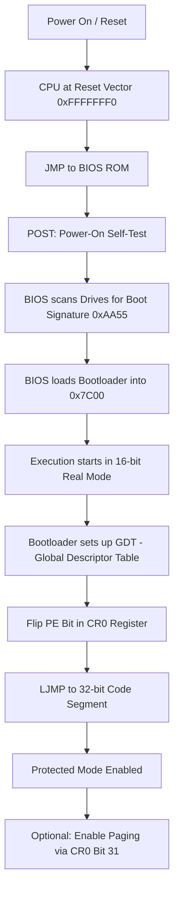

# Real Mode: The 16-Bit Genesis of x86

## 1. Overview
Every modern x86_64 processor begins its life in **Real Mode**. This is a 16-bit operating mode that mimics the original Intel 8086. It is characterized by a 1MB memory limit and no built-in hardware security (no "Ring" protection or virtual memory).

## 2. Memory Addressing (The Segment:Offset Math)
In Real Mode, registers are 16 bits wide, but the address bus is 20 bits wide (allowing for $2^{20}$ or 1MB of RAM). To bridge this gap, the CPU uses **Segmentation**.

### The Formula
The Physical Address is calculated by shifting the Segment register left by 4 bits (multiplying by 16) and adding the Offset.

**Physical Address = (Segment × 0x10) + Offset**

### Calculation Examples
*   **Example A (Accessing the IVT):** `(0x0000 * 0x10) + 0x03FF = 0x003FF`
*   **Example B (Bootloader Entry):** `(0x07C0 * 0x10) + 0x0000 = 0x07C00`
*   **Example C (Maximum Reach):** `(0xFFFF * 0x10) + 0xFFFF = 0x10FFEF` (The "High Memory Area").

## 3. The Boot Flow Chart
This tracks the CPU from power-on to the transition into Protected Mode.

## 4. Key Memory Locations

| Address Range | Name | Description |
| :--- | :--- | :--- |
| `0x00000`–`0x003FF` | **IVT** | Interrupt Vector Table (256 pointers to ISRs) |
| `0x00400`–`0x004FF` | **BDA** | BIOS Data Area (Hardware state/Keyboard buffer) |
| `0x00500`–`0x07BFF` | **Free RAM** | Guaranteed "Scratch" space for the bootloader |
| `0x07C00`–`0x07DFF` | **Bootsector**| The 512-byte "Magic Spot" where code starts |
| `0xA0000`–`0xBFFFF` | **VRAM** | Video RAM for text/graphics modes |
| `0xFFFF0` | **Reset Vector** | Where the CPU looks for the first instruction |

## 5. Breaking the Jail: The CR0 Register
To leave Real Mode, software must modify **Control Register 0 (CR0)**.

| Bit | Flag | Description |
| :--- | :--- | :--- |
| **0** | **PE** | **Protection Enable**: Switches CPU to Protected Mode (selector-based). |
| **31** | **PG** | **Paging Enable**: Enables MMU and page tables (Requires PE=1). |

> **Crucial Rule**: You cannot enable Paging (`PG=1`) without first enabling Protection (`PE=1`).

